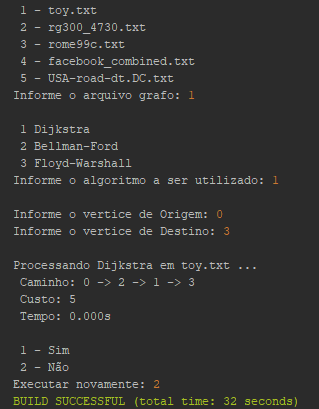

# Shortest Path

  

A console program to find the shortest path using 3 different types of algorithms.

✅ Dijkstra ✅ Bellman-Ford ✅ Floyd-Warshall

To execute the program, you just need to compile all files and run the Main.java file.
